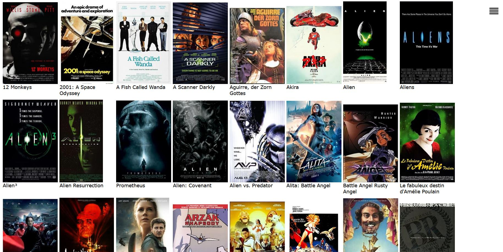
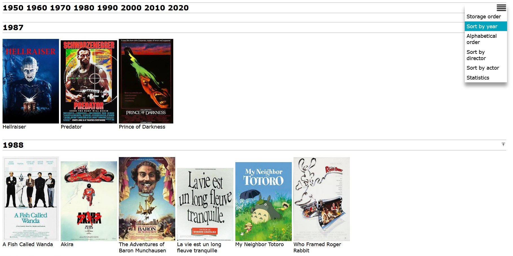
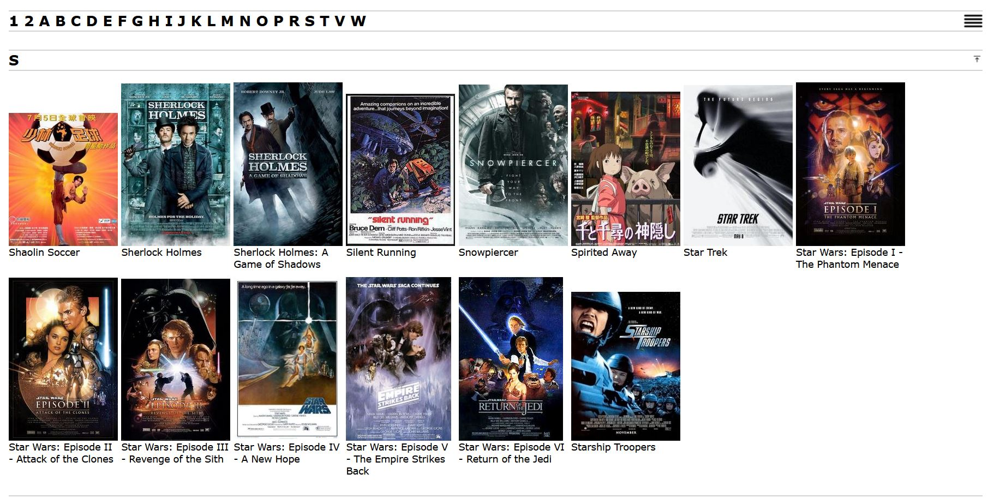
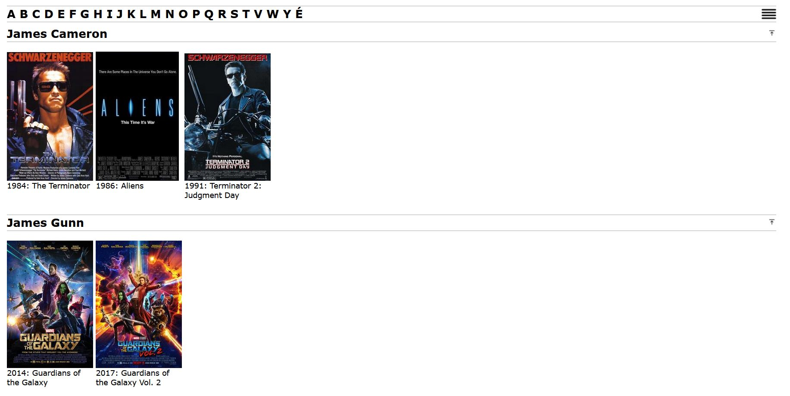
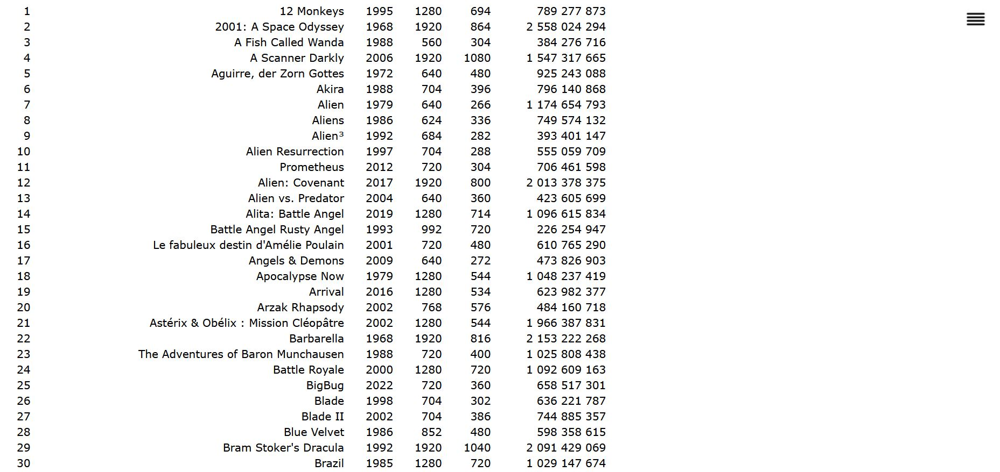
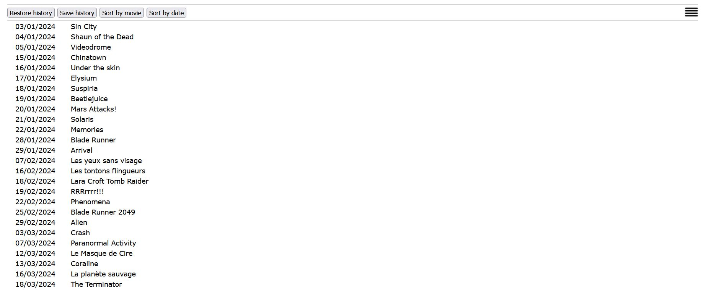
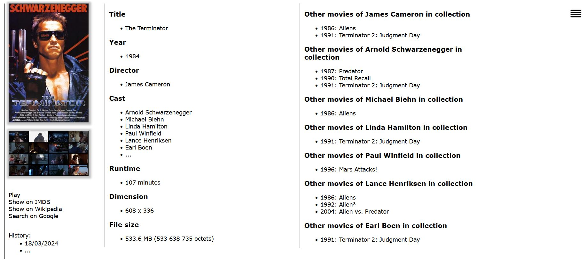

# movielib

A simple movie collection organizer. No need to repeat the information you find on IMDb or Wikipedia. What you are interested in is to list your movies in various orders (alphabetically, by year, by actor, by director) and to find out which movies share the same directors or actors.

`movielib`is a small utility generating the web pages for sorted galleries and movie descriptions. To browse your collection, open the file `index.htm` in the collection directory.

## Views

Several views on your collection is available:

* Bulk view, compact, in the order of the storage directory,
* sorted by title,
* sorted by year,
* sorted by directors,
* sorted by actors,
* statistics (currently dimensions and file size),
* history,
* movie descriptions.

|||
|-----|-----|
|Bulk view | Sort by year|
|||
|Alphabetical sort | Sort by director|
|||
|Statistics | History|

The movie description contains:

*  the main basic movie data, 
*  the lists of movies sharing directors or actors inside the collection, with links from movie to movie,
* the links to IMDb and Wikipedia for the movie,
* the links to Wikipedia for the directors and actors,
* the link to the storyboard (a mosaic of snapshots from the movie),
* the dates of viewing the movie and the button to add a new date.

## Install

Clone the github repository in some directory and launch the following command from this directory:

`pip install .`

After that, the utility is used from the command line by using its name:

`> movielib -h`

##### Note 1

A reminder for the developper that it is possible to install, and use the name entry point, by using the `-e` option:

`pip install -e .`

##### Note 2

Another reminder if you use VLC and Firefox. To start a movie on VLC from Firefox::

* open `about:config`
* set`media.play-stand-alone` to `false`

## Commands

There are only two commands:

* `movielib --update <root directory>`

This command creates and updates all web pages and intermediate files. 

* `movielib --import_imdb_data`

This command enables to download from IMDb and compile to a suitable format the data required to make the link from titles to IMDb Ids. This is done quietly by `--update` a single time when creating the collection. To use more recent data, it is necessary to force the import and this is done by the command.

## Translation

The web pages can be generated using two languages, English or French. Other languages could be added by completing the file `translations.txt`. There are a few strings to translate and the format should be self explanatory. 

## Use cases

##### Creating a collection

A collection is basically a directory (the root) containing movie files. To keep things organized, it is recommended to store each movie in its own subdirectory. In case of series, it is possible to gather movie directories under a serie directory.

To create the collection, use the `--update`command with the name of the root directory:

`movielib --update d:\Movies`

##### Add a movie

Just use `movielib --update`.

##### Rename movie directory

Just use `movielib --update`.

##### Rename movie

Most of the times, the files you find in a movie directory are :
* the movie itself,
* a subtitle file (*.srt). This file should have the same name as the movie file to enable VLC (the recommended player) to use automatically the subtitles,
* a movie cover image,
* a json file,
* and an html file, both latest files are generated by `movielib`.

When renaming the movie file, it is necessary to rename also the srt file and the movie cover as they are generally manualy added to the library.

The two other files (the json and html files) may be renamed, or may be deleted as they are generated again when updating the library.

##### Change movie cover image

Just use `movielib --update`.

##### Modify json

Just use `movielib --update`.

Note for developpers: in some rare cases, it is necessary to delete all json files to force a new generation. This can be the case when the content of the json files evolves and must be updated. In that case, a not documented option enables to remove all json files. This option does not remove the json files without IMDB id. Check however if these files must be manually completed with the related additional information. 

